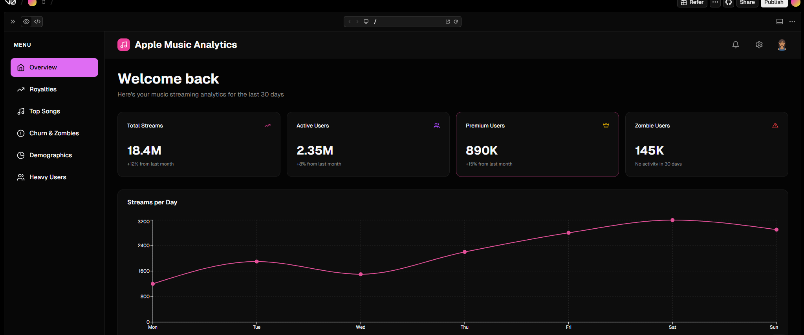
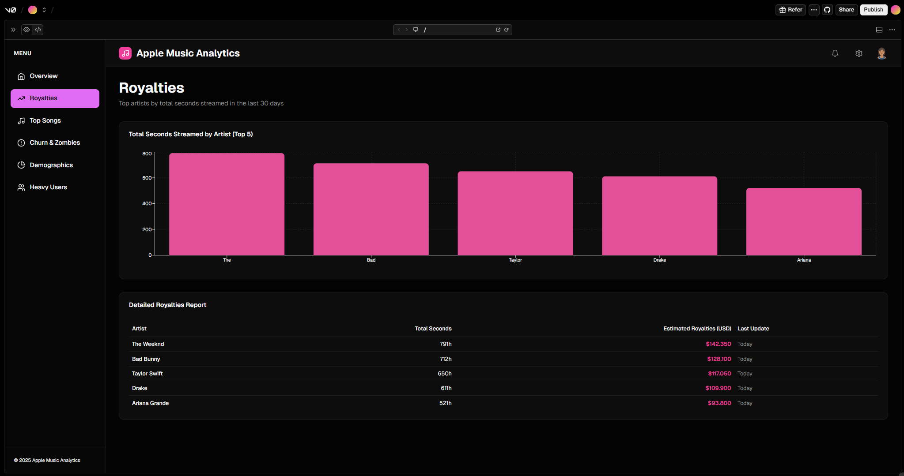
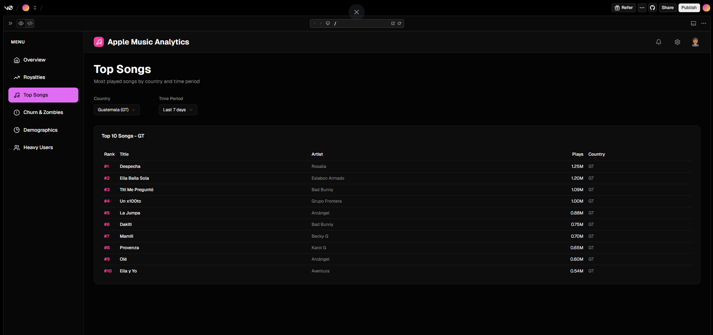
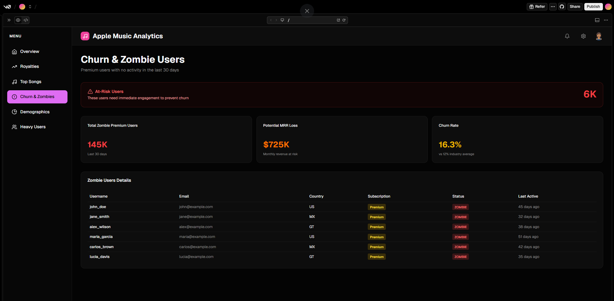
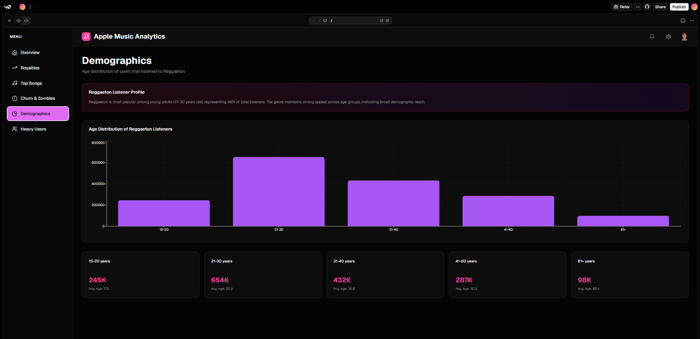

# 🎵 Apple Music – Real-Time Analytics (MongoDB + Docker)
**Examen Final – Bases de Datos II**  
**Universidad Da Vinci de Guatemala**  
**Autor: Byron Rodolfo Maldonado Palacios**

Este proyecto implementa una arquitectura de análisis en tiempo real utilizando **MongoDB**, **Docker**, **Aggregation Pipelines** y un Dashboard creado con **v0.dev**, simulando cómo Apple Music visualizaría métricas críticas de negocio.

---

#  Objetivo del Proyecto
Diseñar una PoC de analíticas en tiempo real que permita:
- Ingerir miles de streams en MongoDB.
- Ejecutar consultas complejas.
- Proveer visualizaciones ejecutivas.
- Definir API para consumo desde Frontend.

---

#  Tecnologías Utilizadas
- MongoDB 6 (Docker)
- Node.js
- Faker.js
- Aggregation Framework
- v0.dev
- Docker Volumes

---

#  Estructura del Repositorio

```
/
├── api-design/
│   └── api-spec.md
│
├── dashboard-v0/
│   ├── prompt.txt
│   └── screenshots/
│       ├── 01-overview.png
│       ├── 02-royalties.png
│       ├── 03-top-songs.png
│       ├── 04-zombies.png
│       ├── 05-demographics.png
│       └── 06-heavy-users.png
│
├── database/
│   ├── docker-compose.yml
│   └── queries.js
│
├── seed.js
├── package.json
└── README.md
```

---

#  1. Levantar MongoDB con Docker

```bash
docker-compose -f database/docker-compose.yml up -d
```

Verificar:

```bash
docker ps
```

---

#  2. Poblar la Base de Datos

```bash
npm install
npm start
```

Salida esperada:

```
 EXITO: Base de datos poblada
- 100 Usuarios (20 sin streams)
- 50 Canciones
- 4989 Streams generados
```

---

#  3. Consultas del Proyecto

Ubicadas en:

```
database/queries.js
```

Pruebas:

```bash
node test.js
node test_top10.js
node test_zombies.js
node test_demografia.js
node test_heavyusers.js
```

---

#  4. Consultas Implementadas

### ✔ Regalías por artista  
### ✔ Top 10 Guatemala  
### ✔ Premium Zombies  
### ✔ Demografía Reggaeton  
### ✔ Heavy Users Bad Bunny  

---

#  5. Documentación de API

Archivo completo:

```
api-design/api-spec.md
```

---

#  6. Dashboard – v0.dev

El dashboard incluye:

- KPIs globales  
- Gráfica de regalías  
- Top 10 regional  
- Usuarios Zombis  
- Demografía por edades  
- Heavy Users  

##  Capturas del Dashboard

### **1️ Overview**


### **2️ Regalías**


### **3️ Top Songs**


### **4️ Zombie Users**


### **5️ Demographics**


### **6️ Heavy Users**


---

#  7. Video del Proyecto

Incluye:

- Explicación general  
- Arquitectura  
- Ejecución en vivo de Pipelines  
- Dashboard  
- Conclusiones  

 **Enlace al video:**  
https://youtu.be/CDxJ3KgElP0

---

#  Créditos

Proyecto desarrollado para **Bases de Datos II**,  
Catedrático **Ing. Brandon Chitay**.  

Autor: **Byron Rodolfo Maldonado Palacios**
